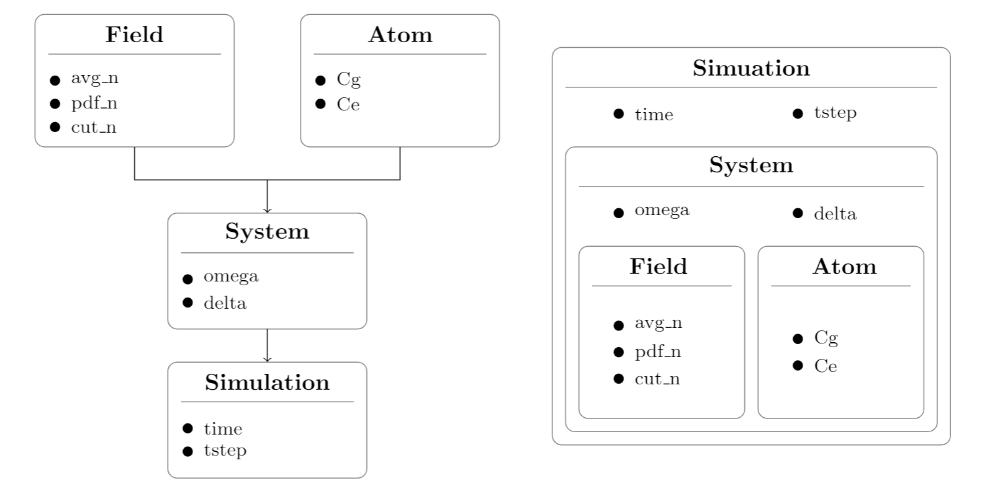

<p>

</p>


# The Jaynes-Cummings model and Rabi Oscillations

The [**Jaynes-Cummings model**](https://en.wikipedia.org/wiki/Jaynes%E2%80%93Cummings_model) (JCM) is a solvable fully quantum mechanical model of an atom in a field. It was first used in 1963 to examine the classical aspects of spontaneous emission and to reveal the existence of [**Rabi oscillations**](https://en.wikipedia.org/wiki/Rabi_cycle) in atomic excitation probabilities for fields with sharply defined energy (or photon number).
For fields having a statistical distribution of photon numbers the oscillations collapse to an expected steady value. In 1980 it was discovered that with appropriate initial conditions (e.g. a near-classical field), the Rabi oscillations would eventually revive, only to collapse and revive repeatedly in a complicated pattern. The existence of these revivals, present in the analytic solutions of the JCM, provided direct evidence for the discreteness of field excitation (photons) and hence for the truly quantum nature of radiation.
The relative simplicity of the JCM and the ease with which it can be extended through analytic expressions or numerical computation continues to motivate attention. Here is presented a brief overview of this theory; if you are interested in learning more about the topic, I recommend reading these papers:

- Bruce W. Shore and Peter L. Knight. **"The Jaynes-Cummings model"**. In: *Journal of Modern Optics*, vol. 40, no. 7, 1195-1238 (1993). DOI: 10.1080/09500349314551321. URL:  [https://www.researchgate.net/publication/243401964_The_Jaynes-Cummings_Model](https://www.researchgate.net/publication/243401964_The_Jaynes-Cummings_Model)
- Fabio D. Bonani. **"The Jaynes-Cummings model"**. (2020). URL:
[https://www.ifsc.usp.br/~strontium/Teaching/Material2020-1 SFI5814 Atomicamolecular/Fabio - Monograph - Jaynes-Cummings model.pdf](https://www.ifsc.usp.br/~strontium/Teaching/Material2020-1%20SFI5814%20Atomicamolecular/Fabio%20-%20Monograph%20-%20Jaynes-Cummings%20model.pdf)  

➡️ Check also this [Notion page](https://sonia-salomoni.notion.site/The-Jaynes-Cummings-model-56651cd955934b1dae5f9bb668545a4f)

___

> ### **INDEX**
> 
> [**Usage**](#Usage)
>
> [**Repository Structure**](#Repository-Structure)
> - [rabi_model](#rabi_model)
>   - [classes](#classes)
>   - [utilities](#utilities)
>   - [tests](#tests)
> - [examples](#examples)
>   - [ex1](#ex1)
>   - [ex2](#ex2)


___


## **Usage**

To *clone the repository* type:
```bash
git clone https://github.com/soniasalomoni/Rabi_oscillations_JCM.git
cd Rabi_oscillations_JCM
```
To *install the dependencies* type the command:
```bash
pip install -r reqs.txt
```

To *run a test*, for example `oracle_test.py`, type the command:
```bash
cd rabi_model
pytest tests/oracle_test.py
```

To *run an example*, for example `example/ex_PDF_n`, type:
```bash
cd example/ex_PDF_n
chmod u+x job.sh
bash job.sh
```

---

## **Repository Structure**

The repository is structured in the following folders:
* **rabi_model**, which contains the actual package;
* **examples**, which shows two usages examples of the code.

---

---

## **rabi_model**

### **classes**

This directory contains the definitions of the classes required to run the simulation.\
Each class is a container that collects and organizes the input data according to a physical meaning and logic. This is the hierarchical structure of the classes:

<p  align="center">
 
</p>

---

> ➡️ **`Atom.py`** 
> 
> This class stores the parameters that describe the state of the atom in the cavity:
> * `Cg` : the *initial ground state coefficient* (float);
> * `Ce` : the *initial excited state coefficient* (float).
> 
> These parameters should be positive, smaller than 1 and normalized.

---

> ➡️ **`Field.py`**
> 
>  This class stores the parameters that describe the cavity field:
> * `avg_n` : the *average number of photons*  (integer);
> * `pdf_n` : the *probability density function of photons* (string);
> * `cut_n` : the *cut-off number of photons*) (integer).
> 
> In addition, the class implements three physically relevant probability distributions of photons: `Dirac`, `Poisson`, and `BoseEinstein`.

---

> ➡️ **`System.py`** 
> 
> This class stores a `Field` and an `Atom` instances.\
> In addition, the class is enriched by two interaction parameters:
> * `omega` : the *interaction coupling* (float);
> * `delta` : the *interaction detuning* (float).
> 
> The class implements a set of complex differential equations through the  `Rabi_model` method that models the time evolution of the system using the Jaynes-Cummings model Hamiltonian.

---

> ➡️ **`Simulation.py`**
> 
> This class contains a `System` instance and time information required to run a simulation on it:
> * `time` : the *simulation duration* (float), 
> * `tstep` : the *simulation time step* (float).
> 
> In particular, it is defined an odeint-like function for complex-valued differential equations `odeintz`.

---

### **utilities**

This folder contains several files that are required to run the simulation.

---

> ➡️ **`reading.py`** 
> 
> This file handles the input reading.\
> In particular, a function `read_txt()` reads the parameter from a **.txt** file. By default, **input.txt** is the default input file but there is also the possibility to specify its name through the first argument.

--- 

> ➡️ **`plotting.py`** 
> 
> This file handles the graphical visualization of the evolution of the inversion function.\
> The plot is saved as a **.png** file if `save_png` in the input file is set to `True`.

--- 

> ➡️ **`saving.py`** 
> 
> This file handles the  produces a **.txt** file containing the inversion function if `save_txt` in the input file is set to `True`. These data can be used later on to do more complex plots.

---

### **tests**

In this folder, the main functions of the program are tested. The testing is mainly performed using the [hypothesis](https://hypothesis.readthedocs.io/en/latest/index.html) library.

---

> ➡️ **`test_Atom.py`**
> 
> This test file checks if `Atom` istances are correctly initialized when valid states are given to the constructor, and viceversa, if errors are correctly raised when invalid states are provided.

---

> ➡️ **`test_Field.py`**
> 
> This test file checks if `Field` istances are correctly initialized when valid parameters are passed to the constructor, and viceversa, if errors are correctly raised when invalid parameters are provided.
> Moreover, a property test is performed on the `Dirac`, `Poisson`, and `BoseEinstein` methods.

---

> ➡️ **`test_System.py`**
> 
> This test file checks if `System` istances are correctly initialized when valid parameters are passed to the constructor, and viceversa, if errors are correctly raised when invalid parameters are provided. Moreover, it is tested the physical meaning of the atomic state time evolution determined by the model implemented in the class.

---

> ➡️ **`test_Simulation.py`**
> 
> This test file checks if `Simulation` istances are correctly initialized when valid parameters are passed to the constructor, and viceversa, if errors are correctly raised when invalid parameters are provided.
> Finally, it is tested that during the simulations the internal parameters evolve correctly or remain contant as expected
> 
---

> ➡️ **`oracle_test.py`** 
> 
> This test file checks if the numerical solution that we obtain executing the simulation is compatible with the analytical solution provided by the theory. With this test we make sure that the algorithm used to solve the complex-differential equation is correct.
An analytical solution is only available in this simplified case; if we want to extend our model to effects not considered so far, the numerical solution becomes the only viable one.

---

---

## **examples**

Each example folder contains two files:

---

> ➡️ **`job.sh`** 
> 
> The *jobscript* contains the setup information needed to automatize the run of `rabi.py` on different input files.

---

> ➡️ **`rabi.py`** 
> 
> The *python script* performs the four steps (reading, running, plotting and saving) sequentially.

---
  
### **ex_AVG_n**

In this example, the jobscript runs `rabi.py` changing the type of PDF `pdf_n`  (**Dirac**, **Poisson**, **BoseEinstein**) while keeping unchanged the rest of input parameters. The label of the output files are also modified accordingly in order to not override them.
In this example it is used the default input file name **input.txt**.

### **ex_PDF_n**

In this example the jobscript runs `rabi.py` varying the average number of photons  `avg_n` (**10**, **30**, **50**) for a field in a coherent state (Poisson PDF) and keeping unchanged the rest of input parameters. The label of the output files are also modified accordingly in order to not override the files. One can modify the selected PDF to observe the different behavior of Rabi oscillations as a function of `avg_n`.
In this example the input file name is changed according to the PDF used.

---
