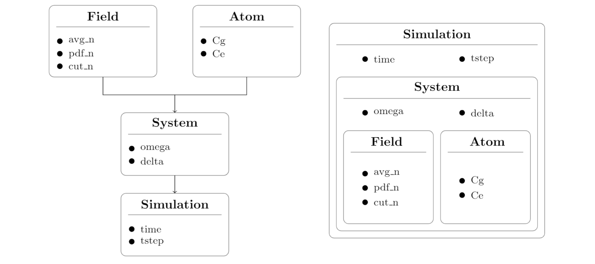

<p>

</p>


# The Jaynes-Cummings model and Rabi Oscillations

The [**Jaynes-Cummings model**](https://en.wikipedia.org/wiki/Jaynes%E2%80%93Cummings_model) (JCM) is a soluble fully quantum mechanical model of an atom in a field. It was first used in 1963 to examine the classical aspects of spontaneous emission and to reveal the existence of [**Rabi oscillations**](https://en.wikipedia.org/wiki/Rabi_cycle) in atomic excitation probabilities for fields with sharply defined energy (or photon number).
For fields having a statistical distribution of photon numbers the oscillations collapse to an expected steady value. In 1980 it was discovered that with appropriate initial conditions (e.g. a near-classical field), the Rabi oscillations would eventually revive, only to collapse and revive repeatedly in a complicated pattern. The existence of these revivals, present in the analytic solutions of the JCM, provided direct evidence for discreteness of field excitation (photons) and hence for the truly quantum nature of radiation.
The relative simplicity of the JCM and the ease with which it can be extended through analytic expressions or numerical computation continues to motivate attention. Here is presented a brief overview of this theory; if you are interested in learning more about the topic, I recommend reading these papers:

- Bruce W. Shore and Peter L. Knight. **"The Jaynes-Cummings model"**. In: *Journal of Modern Optics*, vol. 40, no. 7, 1195-1238 (1993). DOI: 10.1080/09500349314551321. URL:  [https://www.researchgate.net/publication/243401964_The_Jaynes-Cummings_Model](https://www.researchgate.net/publication/243401964_The_Jaynes-Cummings_Model)
- Fabio D. Bonani. **"The Jaynes-Cummings model"**. (2020). URL:
[https://www.ifsc.usp.br/~strontium/Teaching/Material2020-1 SFI5814 Atomicamolecular/Fabio - Monograph - Jaynes-Cummings model.pdf](https://www.ifsc.usp.br/~strontium/Teaching/Material2020-1%20SFI5814%20Atomicamolecular/Fabio%20-%20Monograph%20-%20Jaynes-Cummings%20model.pdf)  

 Check this [Notion page](https://radical-ketch-a32.notion.site/The-Jaynes-Cummings-model-56651cd955934b1dae5f9bb668545a4f)  

**INDEX**

> [**Mathematical formulation**](#Mathematical-formulation)  
> - [The Jaynes-Cummings Hamiltonian](#The-Jaynes-Cummings-Hamiltonian)  
> - [The Jaynes-Cummings ladder](#The-Jaynes-Cummings-ladder)  
> - [Rabi oscillations](#Rabi-oscillations)  
> - [Initial conditions: mixtures](#Initial-conditions-mixtures)  
>  
> [**Repository Structure**](#Code-Structure)
> - [Classes](#Classes)
> - [Utilities](#Utilities)
> - [Testing](#Testing)
> - [Output](#Output)
> - [Jobs](#Jobs)
>
> [**Usage**](#Usage)

## **Mathematical formulation**

### The Jaynes-Cummings Hamiltonian

The Hamiltonian that describes the full system consists of the *free field Hamiltonian* , the *atomic excitation Hamiltonian* , and the *Jaynes–Cummings interaction Hamiltonian* :

<p  align="center">

 <p/>

- **free field Hamiltonian:**  `// Quantization of the free electromagnetic field`  
The operator  is the *number operator*  and its expectation value is a positive integer and represents the number of quantized oscillations present in the system. The operators  and  are the *bosonic creation and annihilation operators* and  is the *angular frequency* of the mode.
- **excitation Hamiltonian:**   `// Quantization of matter`   
the operator  produces a transition from the atomic ground state  to the excited state , while the operator  produces a de-excitation of the atom, making a transition from the state  to the state ;  is the *transition frequency* between the two energy levels of the atom.
The *raising and lowering operators*  and  behave respectively as a sort of *creation and annihilation operators* for electronic excitation.
- **JCM interaction Hamiltonian:**   `// Quantization of interaction`  
The construction of the JCM Hamiltonian is such that each photon creation accompanies an atomic de-excitation, and each photon annihilation accompanies atomic excitation. The conservation of the number of excitation is reached using the [**rotating wave approximation**](https://en.wikipedia.org/wiki/Rotating_wave_approximation) (RWA).  has the dimensions of the inverse of a time and is called the *vacuum* (or single-photon) *Rabi frequency*. This quantity can be seen as a measure of the coupling between light and matter.

The *field frequency* , the *atomic transition frequency* , and the (*vacuum*) *Rabi frequency* , appear as arbitrary parameters in the theory, although in applications they are fixed by physical considerations (e.g. the *cavity volume*  and the *atomic transition moment* , as in the expression ).  
Missing from the JCM Hamiltonian are such effects as cavity loss, multiple cavity modes, atomic sublevel degeneracy and atomic polarizability (leading to dynamic Stark shifts).

### The Jaynes-Cummings ladder

The interaction Hamiltonian can only cause transitions of type , where these product states are referred to be as the *bare states* of the Jaynes-Cummings model. For a fixed , the dynamics of the system are confined to the two-dimensional space of product states .

<p  align="center">

</p>

The Hamiltonian can be written as:

<p  align="center">

</p>

where  corresponds to the energy of the bare state , while  indicates the energy of the state : it is important to note that the two bare states differ for an *energy gap* equal to , with . Finally, the off-diagonal elements  and  model the perturbation given by the interaction terms.  
Due to the presence of the interaction terms, the Jaynes-Cummings Hamiltonian does not have as eigenstates the bare states, but a linear combination of them. By performing the diagonalization of the matrix, it is possible to calculate the energy eigenvalues relating to the new mixed states, called *dressed states*.  
In a similar fashion, also the energies allowed to the system change; in particular, when the system is close to the resonance, that is , a splitting of the energy levels occurs.

<p  align="center">
   <br>
 
<p/>

The new polaritonic states  possess hybrid characteristics, being a combination of photons and electronic excitations. Moreover, in these mixed states, photons and the exciton are said to be *entangled*, since they cannot be written as a simple product of the bases of separate systems.

<p  align="center">
 
</p>

First, we rewrite the Hamiltonian  in a new "reference system", in order to set the energy of the ground state equal to 0 (in practice it is subtracted a term proportional to the identity matrix, which therefore does not modify the dynamics of the system):

<p  align="center">
 
<p/>


We can notice that the curves relating to the energy of the separate system (  ) intersect for , e.g. under conditions of perfect resonance. When the two systems are coupled (  ), however, this degeneration is eliminated, in fact the curves relating to the dressed states are hyperbolas, whose asymptotes are the lines  and  : since the new energies never assume the same value, this situation is called *anti-crossing.*

<p  align="center">
 
</p>

### Rabi oscillations

The Jaynes-Cummings Hamiltonian may be separated into two commuting parts:

<p align="center">
 
</p>

where  represents the Hamiltonian for the field plus the atom and  represents the field-atom interaction. All the dynamics of the system are contained in the second part.

Since it is assumed that the only states involved in the emission and absorption processes are  and , the state function  will be a linear combination of the two states with time-dependent coefficients; this means the system will oscillate over time between one state and another:

<p align="center">
 
</p>

We can now assume that the initial state is  and that the final state is  this choice translates into the initial conditions:

<p align="center">
 
</p>

The Schrodinger equation in the interaction picture is given by:

<p align="center">
 
</p>

and this allows to write down differential equations for the coefficients  and  :

<p align="center">
 <br>
 
</p>

Substituting the first equation into the second and imposing the initial conditions we obtain:

<p align="center">
 <br>
 
</p>

With these coefficients, is possible to determine the probability of the system remains in the ground state   and the probability it makes a transition to the excited state . The atomic inversion then is given by:

<p align="center">
 
</p>

The configuration associated with   can be reached only when there is perfect resonance.
Is interesting to see that in the absence of light (), there is still a non-zero transition probability: this phenomenon is known as *vacuum Rabi oscillations*.

<p  align="center">
 
</p>

### Initial conditions: mixtures

With the introduction of a Hamiltonian one has, in principle, established the time evolution of a quantum system. To complete the definition of a model one must also specify initial conditions.  
Over the years there have been studies of the JCM interacting with a great variety of initial single-mode fields, each with different statistical properties. These studies have shown that there can be remarkable differences in the behavior of the system with different initial conditions.
Assuming the atom in the ground state, the *initial states* of the atom and the field are:

<p align="center">
 <br>
 
</p>

While the initial state of the complete system is given by:

<p align="center">
 
</p>

In this case, to get the inversion function, all the functions  should be multiplied by the coefficients  and added up.

<p align="center">
 
</p>

- An important example occurs when two-state atoms encounter a cavity maintained at a finite temperature , so that the photon number distribution is that of one mode of [*black-body radiation*](https://en.wikipedia.org/wiki/Black-body_radiation), given by the [**Bose-Einstein probability distribution**](https://en.wikipedia.org/wiki/Bose%E2%80%93Einstein_statistics):

<p align="center"></p>

This distribution (termed *thermal* or *chaotic*) maximizes the field entropy for fixed mean photon number  :

<p align="center"> </p>

It is found that populations, for an average number of photons greater than 0, they no longer oscillate in a sinusoidal way: there is almost no trace of population oscillations and after an initial collapse we can observe irregular fluctuations. Furthermore, collapse is found to occur at a precise time scale , fixed by the generalized Rabi frequency. For very large  we find that: .

<p  align="center">
 
</p>

- In the atom-field interaction, one of the most interesting phenomena is the *collapse-revival effect* in population inversion of atomic levels. To see this behavior we have to consider the initial condition in which the field is in a [*coherent state*](https://en.wikipedia.org/wiki/Coherent_state). In this case the number of photons follows a [**Poisson distribution**](https://en.wikipedia.org/wiki/Poisson_distribution):

 <p align="center"></p>
 
 where . It is natural to investigate this type of initial condition since coherent states are often described as states which have the dynamics most closely resembling the oscillatory behavior of a classical harmonic oscillator.\
 As with a thermal cavity, it was found that the Rabi oscillations do not persist indefinitely when the field is initially prepared in a coherent state. Instead, the oscillations collapse to yield constant populations.\
 As the field becomes more intense, and the mean photon number larger, the Rabi oscillations persist for longer intervals, but inevitably the incommensurability of Rabi oscillations for different photon numbers acts to wash out the periodicity of population transfers.\
 What was much more remarkable than the collapses, and unforeseen, was that the Rabi oscillations should revive after a quiescent interval. This *revival time* is essentially the inverse of the separation between distinct Rabi frequencies: .

<p  align="center">
 
</p>


## Repository Structure

The repository is structured in the following folders:

### [Classes](https://github.com/soniasalomoni/Rabi_oscillations_JCM/tree/main/Classes)

This folder contains the definitions of the classes required to run the simulation. Each class is a container that collects and organizes the input data according to a physical meaning and logic. This is the hierarchical structure of the classes:

<p  align="center">
 
</p>

- **`Field.py`:** this class stores the parameters that describe the cavity field  (`avg_n` the *average number of photons* , `pdf_n` the *probability density function of photons*, `cut_n` the *cut-off number of photons*). In addition, the class implements three physically relevant probability distributions of photons: `Dirac`, `Poisson`, and `BoseEinstein`.
- **`Atom.py`:** this class stores the parameters that describe the state of the atom in the cavity (`Cg` the *initial ground state coefficient*, `Ce` the *initial excited state coefficient)*.
- **`System.py`:** this class stores a `Field` and an `Atom` instances. In addition, the class is enriched by some interaction parameters (`int_coupling` the *interaction coupling* , `int_detuning` the *interaction detuning* ).
The class implements a set of complex differential equations through the method `Rabi_model` that models the time evolution of the system using the Jaynes-Cummings model Hamiltonian.
- **`Simulation.py`:** this class contains a `System` instance and time information required to run a simulation on it (`time` the *simulation duration*, `tstep` the *simulation time step*). In particular, it is defined an odeint-like function for complex-valued differential equations `odeintz`.

### [Utilities](https://github.com/soniasalomoni/Rabi_oscillations_JCM/tree/main/Utilities)

This folder contains several files that are required to run the simulation. In particular, we distinguish:

- **`input.txt`:** this is the configuration file, where we set all the simulation parameters.
- **`reqs.txt`:** this file contains the dependencies needed in order to run the simulation.
- **`saving.py`:** this file produces a **.txt** file containing the inversion function if `save_txt` is set to `True`.
- **`plotting.py`:** this file handles the graphical visualization of the inversion function. The plot is saved as a **.png** file if `save_png` is set to `True`.

### [Testing](https://github.com/soniasalomoni/Rabi_oscillations_JCM/tree/main/Testing)

In this folder, the main functions of the program are tested. The testing is performed using the library [hypothesis](https://hypothesis.readthedocs.io/en/latest/index.html). Two types of testing are performed:

- **`prop_test.py`:** in this file we make sure that the **Field methods** `Dirac`, `Poisson`, and `BoseEinstein` are actually PDFs, thus we test that:

    - PDF() is non-negative for all possible values of n.
    - PDF() over all possible values of  is normalized.

- **`oracle_test.py`:** in this file we check that the numerical solution that we obtain executing the simulation is compatible with the analytical solution provided by the theory. With this test we make sure that the algorithm used to solve the complex-differential equation is correct.
An analytical solution is only available in this simplified case; if we want to extend our model to effects not considered so far, the numerical solution becomes the only viable one.

### [Output](https://github.com/soniasalomoni/Rabi_oscillations_JCM/tree/main/Output)

This folder will contain the **.txt** and **.png** files if `save_txt` and  `save_png` in the `input.txt` file are set to `True`. The name of the file is specified by `out_label`. The **.png** file can be used to verify the expected behavior, while the **.txt** files can be used to build more complex graphical representation.

### [Jobs](https://github.com/soniasalomoni/Rabi_oscillations_JCM/tree/main/Jobs)

This folder contains two *jobscripts* (**.sh** files) containing the setup information needed to automatize the run of `Rabi.py` on different input files:

- **`jobPDF.sh`:** this jobscript runs Rabi.py changing the type of PDF `pdf_n` (*Dirac*, *Poisson*, *BoseEinstein*) and keeping unchanged the rest of input parameters. The label of the output files are also modified accordingly in order to not override them.
- **`jobAVGn.sh`:** this jobscript runs Rabi.py changing the average number of photons  `avg_n` (**10**, **30**, **50**) for a field in a coherent state and keeping unchanged the rest of input parameters. The label of the output files are also modified accordingly in order to not override the files. One can modify the selected PDF to observe the different behavior of Rabi oscillations in function of .

## Usage

To clone the repository type:
```bash
git clone https://github.com/soniasalomoni/Rabi_oscillations_JCM.git
cd Rabi_oscillations_JCM
```
To install the dependencies type the command:
```bash
pip install -r Utilities/reqs.txt
```

To launch the main script `Rabi.py`, with the possibility to specify the configuration file as `sys.argv[1]`, type the command:
```bash
python Rabi.py my_input_file.txt
```

The default configuration file if not specified through `sys.argv[1]` is `input.txt`.

To run a test, for example `prop_test.py`, type the command:
```bash
pytest prop_test.py
```

To run a jobscript, for example `jobPDF.sh`, first type this command to make the script executable:
```bash
chmod u+x jobPDF.sh
```
Then:
```
./Jobs/jobPDF.sh
```
